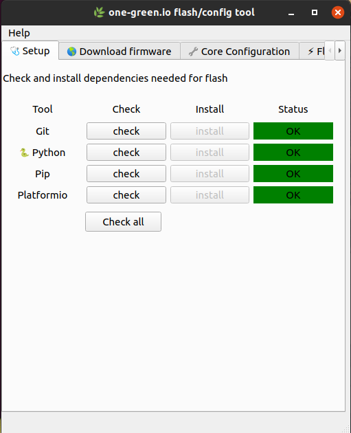
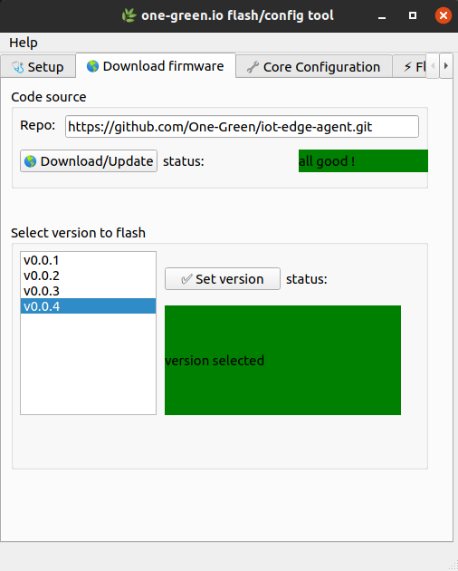
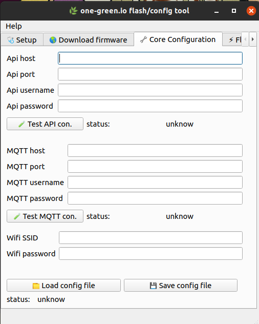
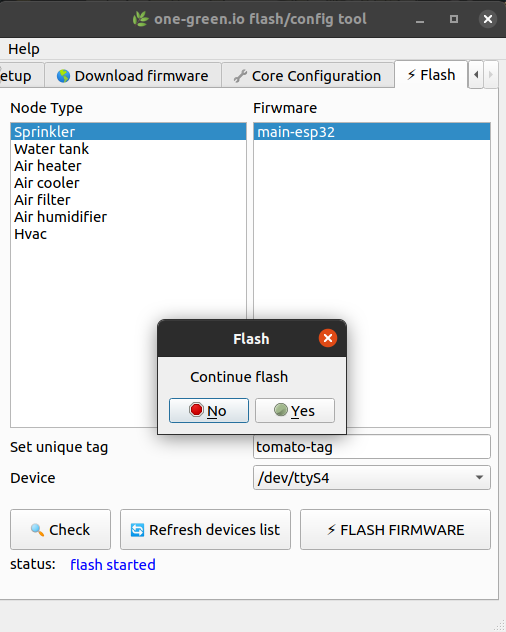

**************
Use Flash tool
**************

.. warning::

    Application start will fail if Git is not installed.
    Ensure Git is installed (in many linux git is already installed)

    Download Git :

    - macos : https://git-scm.com/download/mac

    - linux : https://git-scm.com/download/linux

    - windows : https://git-scm.com/download/windows

Download
--------

Download latest release by following this `link <https://github.com/One-Green/iot-flash-config-tool/releases>`_.

Execute
-------

.. tabs::

   .. tab:: Macos/Linux

      .. code-block:: shell

        ./iot-flash-config-tool
        # logs will be printed like below
        DEBUG:default-logger: loading ui
        DEBUG:default-logger: ui loaded
        DEBUG:default-logger: loading handlers classes
        DEBUG:default-logger: listing usb tty
        DEBUG:default-logger: port list ['/dev/ttyS4']
        DEBUG:default-logger: loading handlers classes: done
        DEBUG:default-logger: linking button to actions
        DEBUG:default-logger: linking button to actions done

   .. tab:: Windows

      .. code-block:: shell

        & "c:\<binary-location>\iot-flash-config-tool.exe"
        # logs will be printed like below
        DEBUG:default-logger: loading ui
        DEBUG:default-logger: ui loaded
        DEBUG:default-logger: loading handlers classes
        DEBUG:default-logger: listing usb tty
        DEBUG:default-logger: port list ['/dev/ttyS4']
        DEBUG:default-logger: loading handlers classes: done
        DEBUG:default-logger: linking button to actions
        DEBUG:default-logger: linking button to actions done

Dependencies check
------------------

To flash, some binary are required , you can check if these binaries are available on your computer.
App will also help you to install dependencies.

.. warning::

    If you are installing Python 3.x make sure **append to PATH** is checked

Download Firmware
-----------------

Download firmware and select version

Set Core and Wifi parameter
---------------------------

Set One-Green Core and Wifi parameters.

.. tip::

    You can save and load config file, the file format is YAML

.. warning::

    Nothing is encrypted keep this file in safe place

Flash
-----

Select firmware, set an unique tag, select device and click flash.

Flash failed / support
----------------------

If flash failed a log file  **pio.log** is generated.
Feel free to open a ticket by following this `link <https://github.com/One-Green/iot-flash-config-tool/issues>`_

.. warning::

    Logs may contain sensible credentials like Wifi password and One-Green Core secret.

    Make sure to remove credentials before sharing logs.

