------------------------------
Deploy Core Stack (Helm chart)
------------------------------

Helm is an easy way to deploy kubernetes resources.

.. note::

  Helm is a tool to create kubernetes deployment templates, versioning, upgrade, installation and more.
  Helm official documentation: https://helm.sh

First, we need to clone helm chart and update dependencies

.. code-block:: shell

    git clone https://github.com/One-Green/helm.git
    cd helm
    # one-green stack have other chart dependencies, to download these dependencies run:
    helm dependencies update

As example for Raspberry Pi deployment, we already created values.yaml file named **values_raspberry_pi_microk8s.yaml**.

.. note::

    values.yaml is one of the way used by helm to install/upgrade a kubernetes deployment. Keep this files versioned or backup
    if you wan't to deploy again, with same configuration.

In file **values_raspberry_pi_microk8s.yaml**, **line 75**, replace **192.168.0.5** by your Raspberry Pi IP or host.
Now once done, it's time to deploy.

.. code-block:: shell

    sudo microk8s helm3 upgrade  one-green-core -f values_raspberry_pi_microk8s.yaml . --namespace default --install
    # will output something like:
    # Release "one-green-core" does not exist. Installing it now.
    # NAME: one-green-core
    # LAST DEPLOYED: Tue Feb  2 23:32:06 2021
    # NAMESPACE: default
    # STATUS: deployed
    # REVISION: 1

    # watch until deployment is done
    sudo microk8s kubectl get po --watch
    # NAME                                      READY   STATUS              RESTARTS   AGE
    # one-green-core-ui-5497dd678f-dnb95        0/1     ContainerCreating   0          65s
    # one-green-core-sprinklers-controller-0    0/1     ContainerCreating   0          64s
    # one-green-core-api-756dfd65d7-snrkk       0/1     Init:0/1            0          64s
    # one-green-core-telegraf-0                 0/1     ContainerCreating   0          64s
    # one-green-core-mqtt-0                     0/1     ContainerCreating   0          64s
    # one-green-core-water-controller-0         0/1     ContainerCreating   0          64s
    # one-green-core-tsdb-0                     0/1     ContainerCreating   0          64s
    # one-green-core-grafana-7886f7d45f-58fzt   0/1     PodInitializing     0          64s
    # one-green-core-influxdb-0                 0/1     ContainerCreating   0          61s

If deployment is done

.. code-block:: shell

    # do CTL+C to quit and reuse  "sudo microk8s kubectl get po --watch" to check
    # NAME                                      READY   STATUS    RESTARTS   AGE
    # one-green-core-ui-5497dd678f-dnb95        1/1     Running   0          15m
    # one-green-core-telegraf-0                 1/1     Running   0          15m
    # one-green-core-mqtt-0                     1/1     Running   0          15m
    # one-green-core-water-controller-0         1/1     Running   0          15m
    # one-green-core-tsdb-0                     1/1     Running   0          15m
    # one-green-core-grafana-7886f7d45f-58fzt   1/1     Running   0          15m
    # one-green-core-influxdb-0                 1/1     Running   0          15m
    # one-green-core-sprinklers-controller-0    1/1     Running   1          15m
    # one-green-core-api-756dfd65d7-snrkk       1/1     Running   0          15m
    # USE CTL+C to quit watch

Now you can:

    - connect IoT devices on MQTT

    - access to Grafana, create dashboard, add alert management

    - access to Admin-UI

**Access to services**
----------------------

If all services are up, use this command

.. code-block:: shell

    sudo microk8s kubectl get services -n default
    # NAME                      TYPE        CLUSTER-IP       EXTERNAL-IP   PORT(S)          AGE
    # kubernetes                ClusterIP   10.152.183.1     <none>        443/TCP          3d12h
    # one-green-core-ui         ClusterIP   10.152.183.208   <none>        8501/TCP         3d11h
    # one-green-core-tsdb       ClusterIP   10.152.183.160   <none>        5432/TCP         3d11h
    # one-green-core-mqtt       NodePort    10.152.183.79    <none>        1883:30181/TCP   3d11h
    # one-green-core-influxdb   ClusterIP   10.152.183.202   <none>        8086/TCP         3d11h
    # one-green-core-api        ClusterIP   10.152.183.64    <none>        8080/TCP         3d11h
    # one-green-core-grafana    ClusterIP   10.152.183.177   <none>        80/TCP           3d11h

Mqtt server
  - ip/dns: your_raspberry_pi_ip
  - port: **30181**
  - default user: **admin**
  - default password: **anyrandompassword**

Grafana
  - url: http://your_raspberry_pi_ip/one-green-core-grafana
  - user: **admin**
  - password:

.. code-block:: shell

   # use this cmd command::
   sudo microk8s kubectl get secret --namespace default one-green-core-grafana -o jsonpath="{.data.admin-password}" | base64 --decode ; echo
   # password is like
   XqBSWrnJ8sy0bdOj9cYb0SMPXEY3oNfE8qdgveQG

Core-ui
  - url: http://your_raspberry_pi_ip/one-green-core-ui
  - no user/password for now

Test MQTT connexion
-------------------

Software requirements
 - MQTT.fx (install from http://www.mqttfx.jensd.de/index.php/download)

Stack is deployed on Raspberry, now we can connect to Mqtt broker to ensure Publish/Subscription is working.
Use Mqtt server parameter to try connection, by following steps.

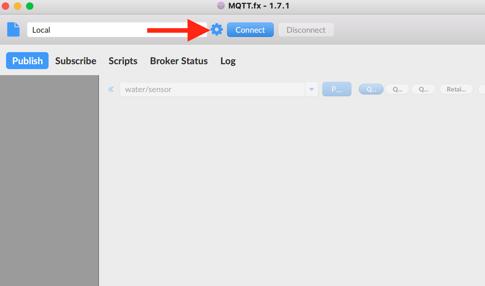

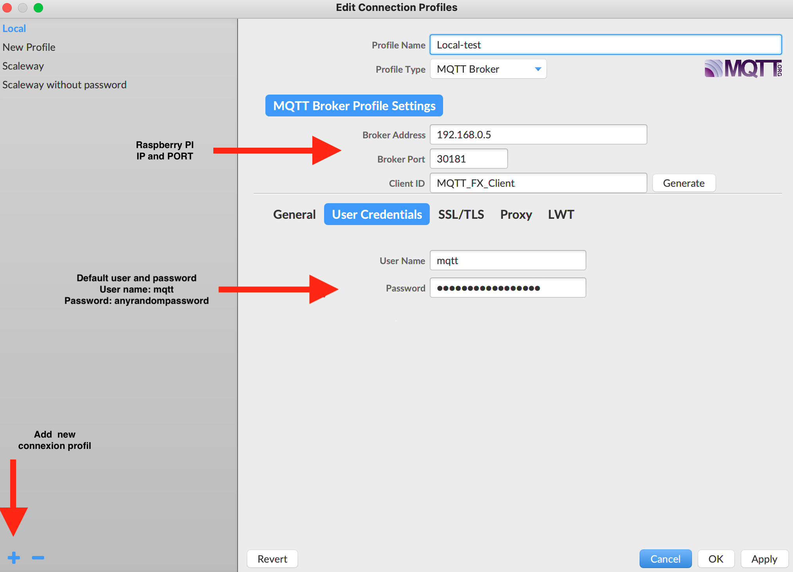

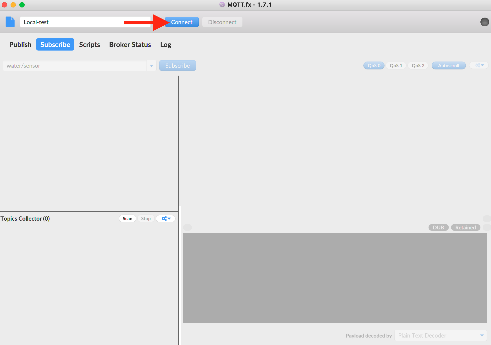

Once connected, we can test publish/subscribe on **echo/test**

First subscribe on topic **echo/test**

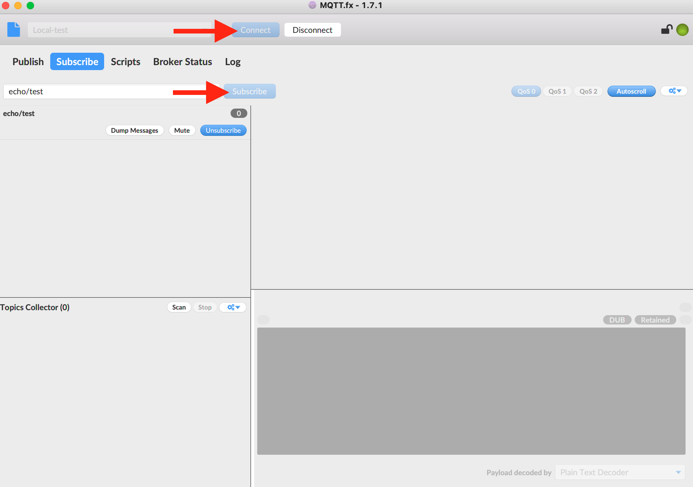

Then publish a message on topic **echo/test**

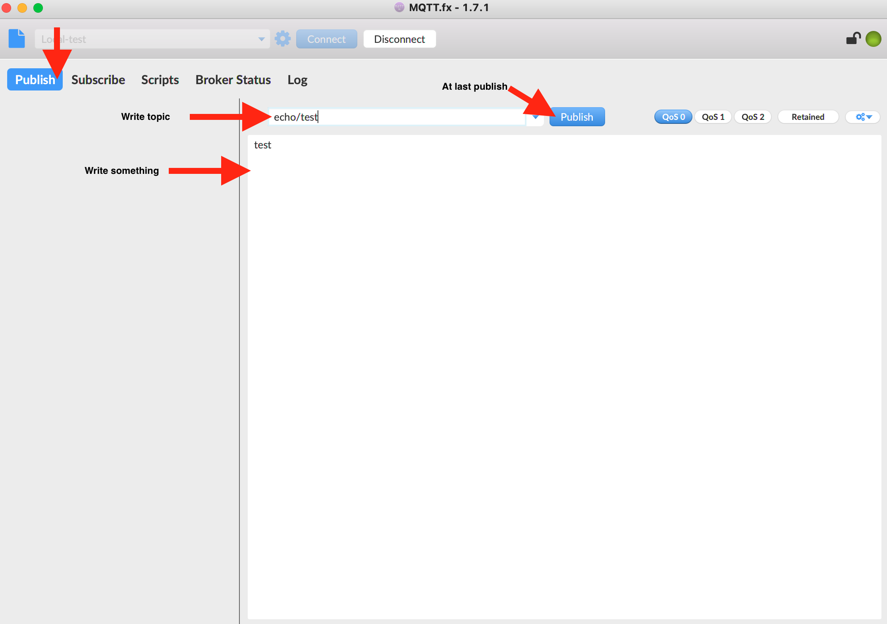

Go back to subscribe tab and check message is published

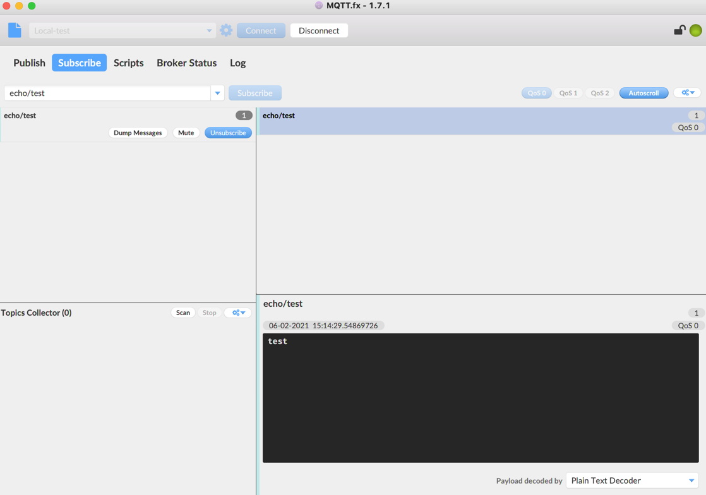

.. note::

    If your message is received we can consider broker parameter are good :)

Setup Grafana
-------------

Open Grafana in browser with url: http://your_raspberry_pi_ip/one-green-core-grafana
(user = **admin**, password = get password with cmd mentioned in :ref:`**Access to services**`)

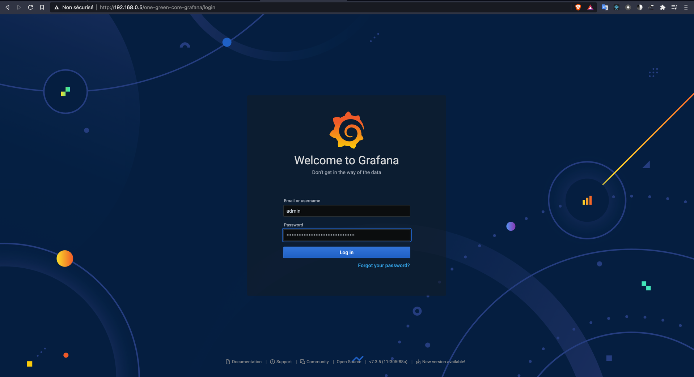

Once connected we must connect InfluxDB

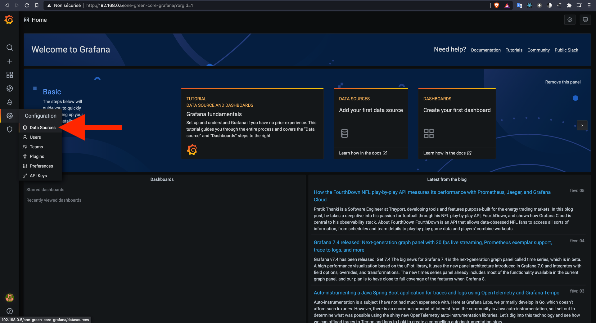

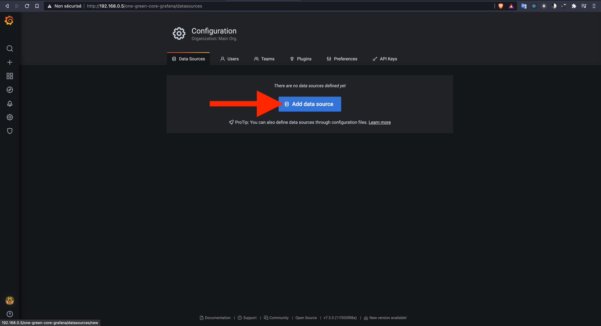

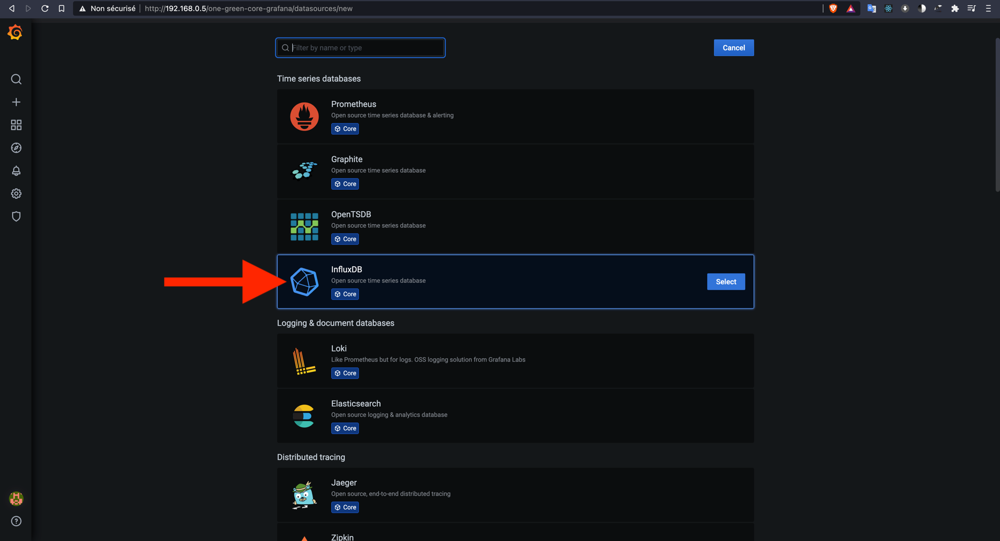

Default parameter:

 - [HTTP] URL : http://one-green-core-influxdb:8086
 - [InfluxDB Details] Database: **one_green**
 - [InfluxDB Details] User: **admin**
 - [InfluxDB Details] Password: **anyrandompassword**

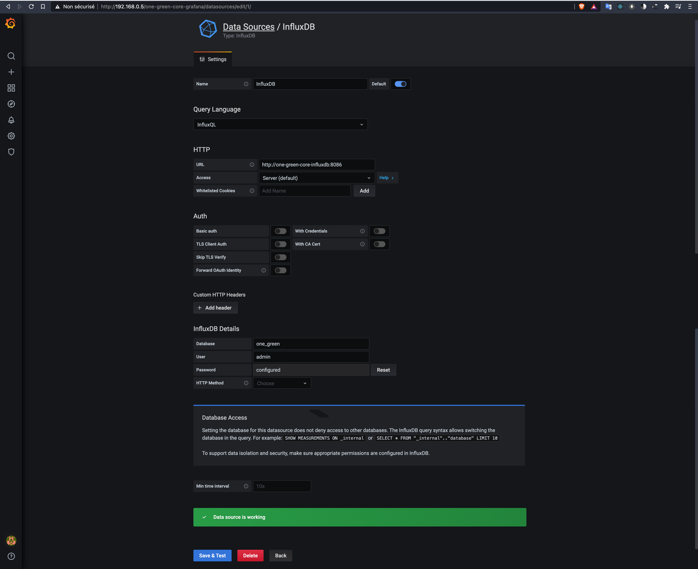
