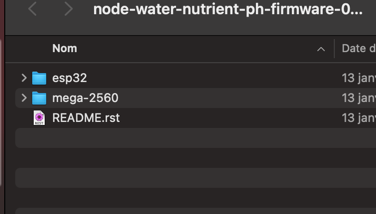
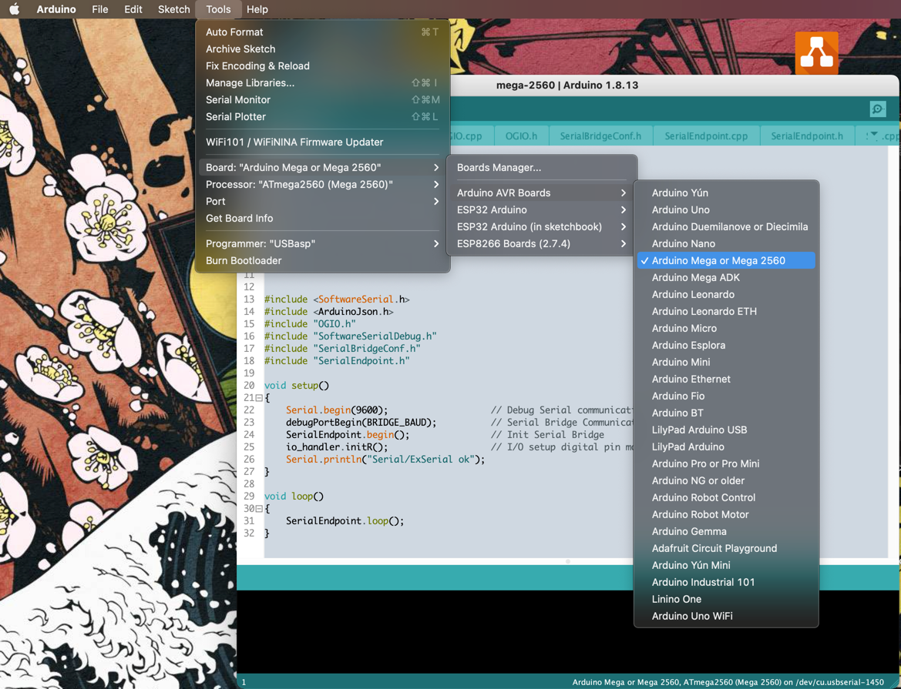
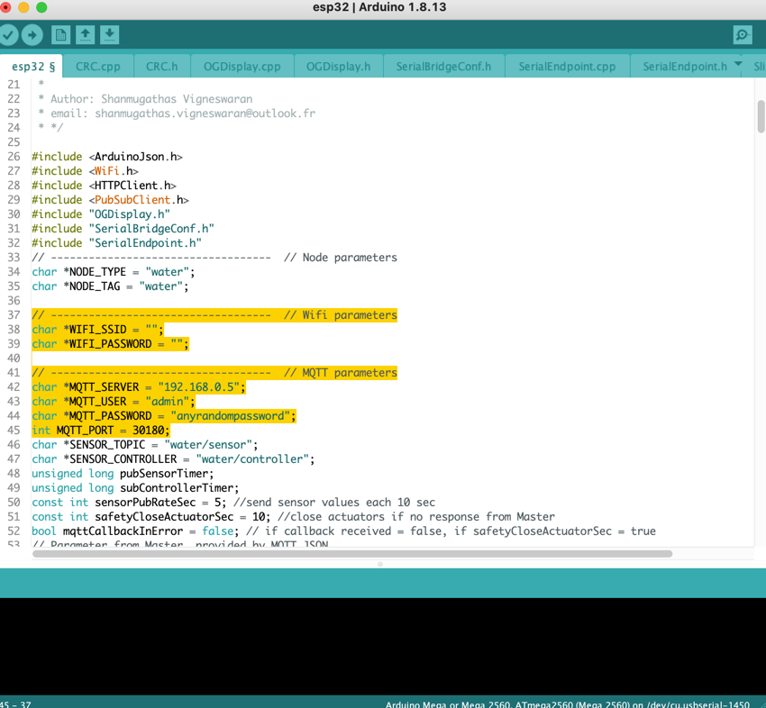
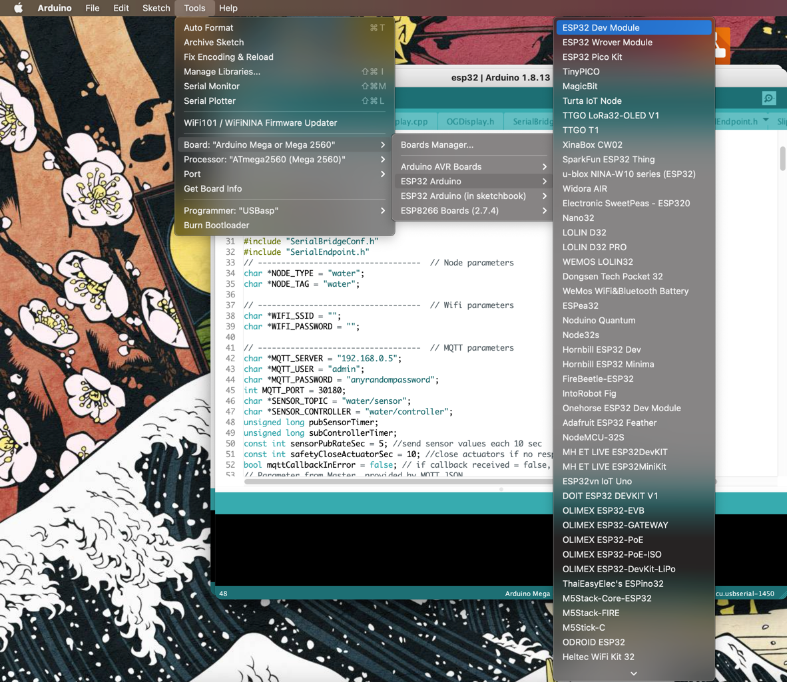

*************************
Flash Water Tank firmware
*************************

Requirements
------------

Platform requirements: :ref:`Water Tank`

Software requirements:

  - :ref:`Prepare Arduino IDE`
  - :ref:`Deploy Core on Raspberry Pi (MicroK8s)`

Flash
-----

Download **zip** from last release : https://github.com/One-Green/node-water-nutrient-ph-firmware/releases

Unzip files

Connect Mega 2560 USB-UART, open **mega-2560/mega-2560.ino** with Arduino IDE, select appropriated PORT and flash

Connect ESP32 USB-UART, open **esp32/esp32.ino** with Arduino IDE.
Change: Wifi and Mqtt parameters.

Change Board, PORT and flash

