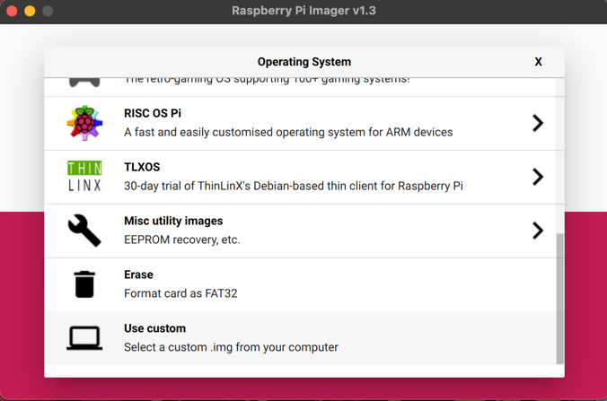
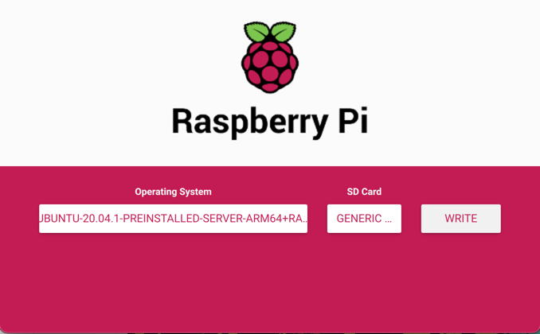
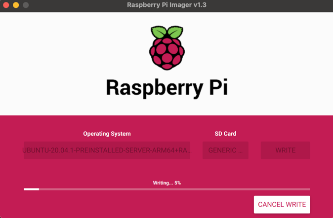
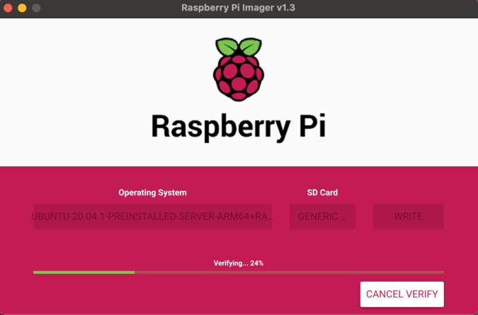
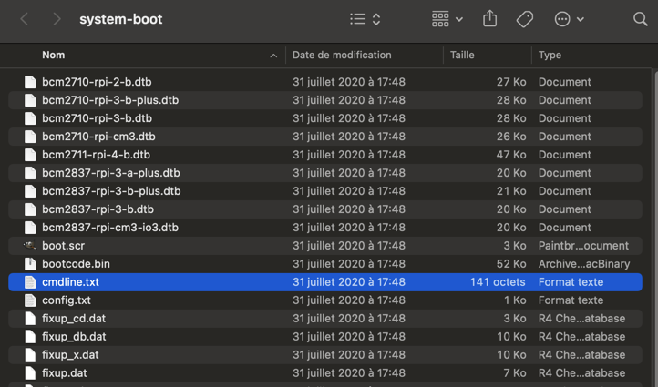

******************************
Install Ubuntu on Raspberry Pi
******************************

Requirements:
 - Raspberry PI 4 B board (4CPU, 4GB) less ressources is not suitable
 - At least 16Gi SD Card

Download assets
---------------

To flash Ubuntu in SD you will required :

 - Download Raspberry Pi Imager (OS flash tool):    https://www.raspberrypi.org/software/

 - Download **Ubuntu Server 20.04.1 LTS 64-Bit** for **Raspberry Pi 4** : https://ubuntu.com/download/raspberry-pi

Flash Ubuntu on SD Card
-----------------------

Select other image

Select SD Card

Click on write and wait

You can cancel verification

Edit **cmdline.txt**
--------------------

.. warning::

  In order to get Microk8s working on this Ubuntu, you need to edit **cmdline.txt**

  This step is the most important, do not skip this one.

Put again SD card on you computer, with fresh flashed Ubuntu.

Open **cmdline.txt** at SD card root

Something like that will appear

.. code-block:: shell

    net.ifnames=0 dwc_otg.lpm_enable=0 console=serial0,115200 console=tty1 root=LABEL=writable rootfstype=ext4 elevator=deadline rootwait fixrtc

Append at the end of line :

.. code-block:: shell

    cgroup_enable=memory cgroup_memory=1

Once **cmdline.txt** has been edited, the file will be like that:

.. code-block:: shell

    net.ifnames=0 dwc_otg.lpm_enable=0 console=serial0,115200 console=tty1 root=LABEL=writable rootfstype=ext4 elevator=deadline rootwait fixrtc cgroup_enable=memory cgroup_memory=1

Save and close **cmdline.txt**.

Remove SD card safely.

Default ssh credentials
-----------------------

- User: **ubuntu**

- Password: **ubuntu**