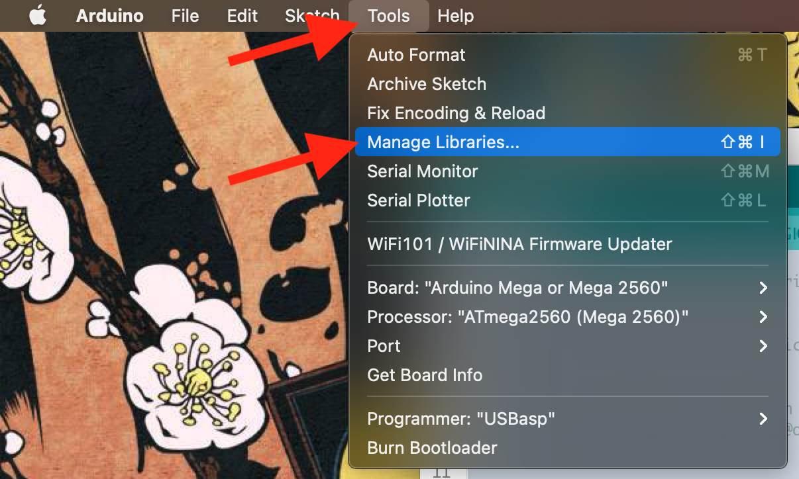
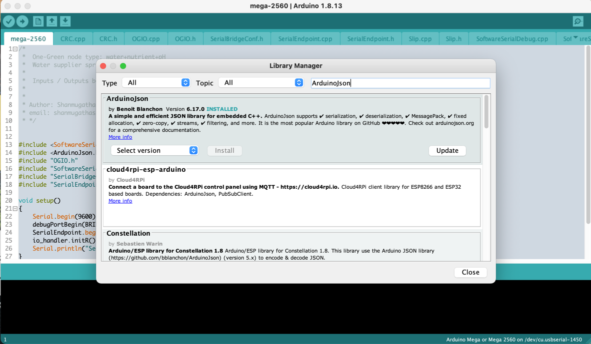

*******************
Prepare Arduino IDE
*******************

Software requirements:
 - Git (install from https://git-scm.com/downloads)
 - Arduino IDE (install from https://www.arduino.cc/en/software)
 - Arduino-ESP32 flash tool chain (install by following https://github.com/espressif/arduino-esp32#installation-instructions)

Install external package
------------------------

Install these packages:
    - ArduinoJson
    - Adafruit ST7735 and ST7789 Library
    - PubSubClient
    - EspSoftwareSerial

