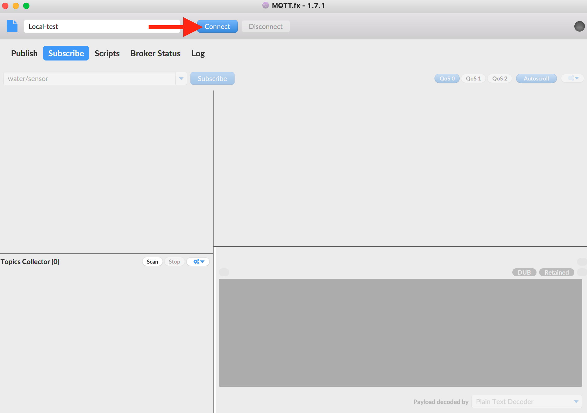
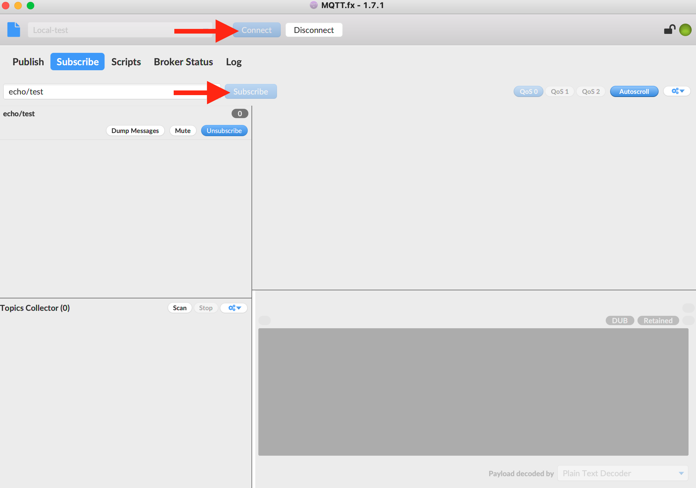
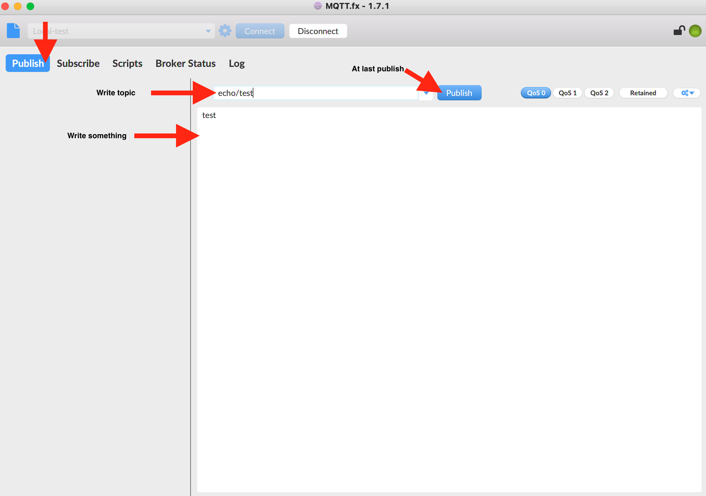
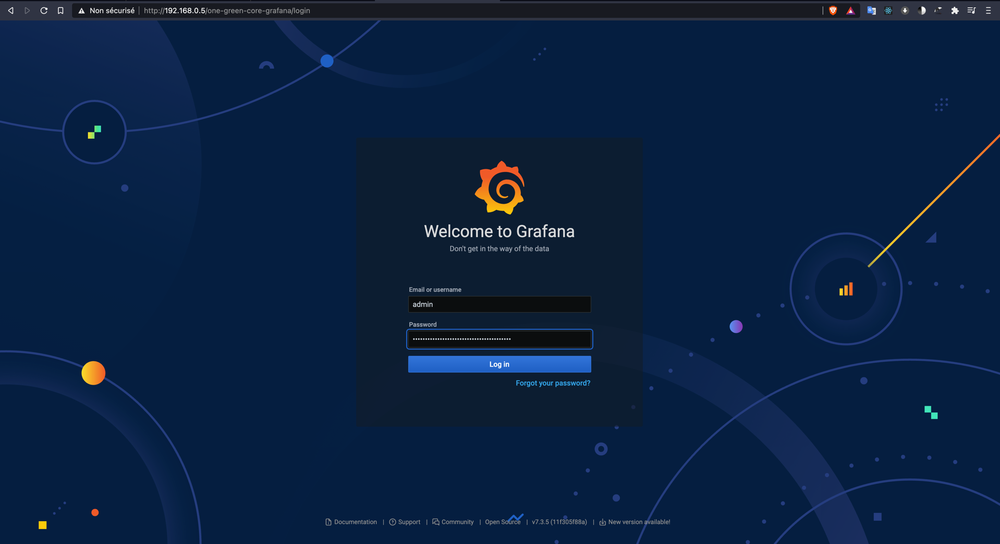
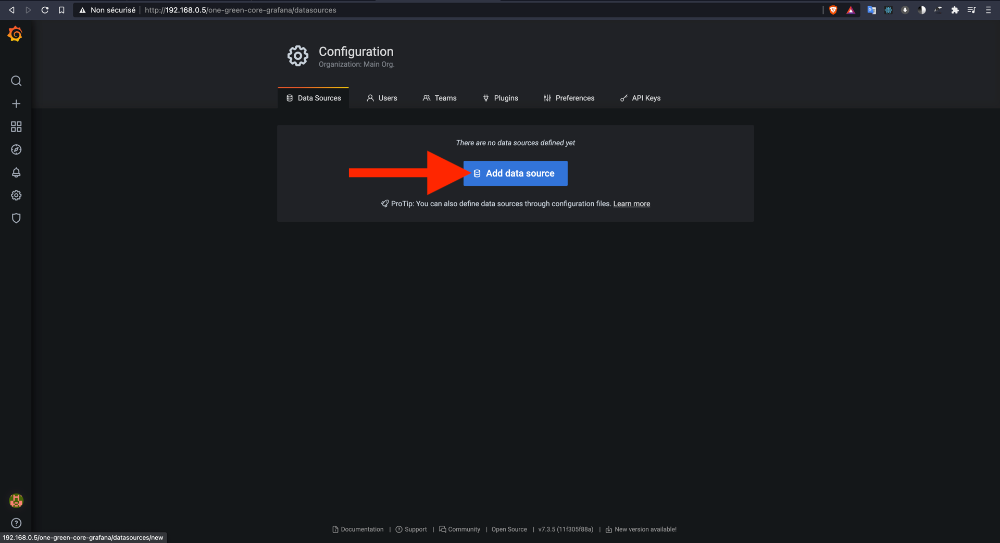

**************************************
Deploy Core on Raspberry Pi (MicroK8s)
**************************************

Official documentation: https://microk8s.io/docs

Hardware requirements:
 - Raspberry PI 4 B board (4CPU, 4GB) less ressource is not suitable
 - At least 20Gi SD Card

The core stack deployment is based on Kubernetes, for that we install MicroK8s on Raspberry Pi.

Check cmdline.txt
-----------------

.. warning::

  If **cmdline.txt** do not contain **cgroup_enable=memory cgroup_memory=1** MicroK8s will not work well.
  You will get error such as : Node Not Ready or unable to schedule pod.

Check if **cmdline.txt** contain **cgroup_enable=memory cgroup_memory=1**

.. code-block:: shell

   if ! grep -q "cgroup_enable=memory cgroup_memory=1" "/boot/firmware/cmdline.txt";
    then echo "cmdline.txt is not good ! edit by using \"sudo vim /boot/firmware/cmdline.txt\" to append cgroup_enable=memory cgroup_memory=1 at the end of line"
    else echo "cmdline.txt is good"
   fi

If OK go to next step.

If not edit by using :

.. code-block:: shell

    sudo vim /boot/firmware/cmdline.txt
    # append without double quote "cgroup_enable=memory cgroup_memory=1" at the end of line
    sudo reboot

.. warning::

    Reboot is required

Update firewall rules
---------------------

.. code-block:: shell

    sudo ufw allow in on cni0 && sudo ufw allow out on cni0
    sudo ufw default allow routed

Install Microk8s
----------------

One line command to install, this operation can take ~10 min.
Change **--channel=xx** by updated version provided by Canonical https://microk8s.io/docs

.. code-block:: shell

    sudo snap install microk8s --classic --channel=1.19
    # outputs will be like :
    # Download snap "microk8s" (1884) from channel "1.19" ............. 26% 1.74MB/s 1m18s
    # Setup snap "microk8s" (1884) security profiles                                                                                                                              /
    # Run install hook of "microk8s" snap if present                                                                                                                              \
    # microk8s (1.19/stable) v1.19.6 from Canonical✓ installed

Install Microk8s addons
-----------------------

Enable dns, local persistant storage provider, helm and nginx loadbalancer

This operation can take ~15 min.

.. code-block:: shell

    sudo microk8s enable dns storage helm3 ingress
    # outputs will be like:
    # Enabling DNS
    # Applying manifest
    # serviceaccount/coredns created
    # configmap/coredns created
    # deployment.apps/coredns created
    # service/kube-dns created
    # clusterrole.rbac.authorization.k8s.io/coredns created
    # clusterrolebinding.rbac.authorization.k8s.io/coredns created
    # Restarting kubelet
    # DNS is enabled
    # Enabling default storage class
    # deployment.apps/hostpath-provisioner created
    # storageclass.storage.k8s.io/microk8s-hostpath created
    # serviceaccount/microk8s-hostpath created
    # clusterrole.rbac.authorization.k8s.io/microk8s-hostpath created
    # clusterrolebinding.rbac.authorization.k8s.io/microk8s-hostpath created
    # Storage will be available soon
    # Enabling Helm 3
    # Fetching helm version v3.0.2.
    #   % Total    % Received % Xferd  Average Speed   Time    Time     Time  Current
    #                                  Dload  Upload   Total   Spent    Left  Speed
    # 100 10.3M  100 10.3M    0     0   736k      0  0:00:14  0:00:14 --:--:-- 1680k
    # Helm 3 is enabled
    # Enabling Ingress
    # namespace/ingress created
    # serviceaccount/nginx-ingress-microk8s-serviceaccount created
    # clusterrole.rbac.authorization.k8s.io/nginx-ingress-microk8s-clusterrole created
    # role.rbac.authorization.k8s.io/nginx-ingress-microk8s-role created
    # clusterrolebinding.rbac.authorization.k8s.io/nginx-ingress-microk8s created
    # rolebinding.rbac.authorization.k8s.io/nginx-ingress-microk8s created
    # configmap/nginx-load-balancer-microk8s-conf created
    # configmap/nginx-ingress-tcp-microk8s-conf created
    # configmap/nginx-ingress-udp-microk8s-conf created
    # daemonset.apps/nginx-ingress-microk8s-controller created
    # Ingress is enabled

Wait until Microk8s is ready
----------------------------

.. code-block:: shell

    sudo microk8s status --wait-ready
    # if microk8s is ready, you should get :
    #microk8s is running
    #high-availability: no
    #  datastore master nodes: 127.0.0.1:19001
    #  datastore standby nodes: none
    #addons:
    #  enabled:
    #    dns                  # CoreDNS
    #    ha-cluster           # Configure high availability on the current node
    #    helm3                # Helm 3 - Kubernetes package manager
    #    ingress              # Ingress controller for external access
    #    storage              # Storage class; allocates storage from host directory
    #  disabled:
    #    dashboard            # The Kubernetes dashboard
    #    helm                 # Helm 2 - the package manager for Kubernetes
    #    host-access          # Allow Pods connecting to Host services smoothly
    #    linkerd              # Linkerd is a service mesh for Kubernetes and other frameworks
    #    metallb              # Loadbalancer for your Kubernetes cluster
    #    metrics-server       # K8s Metrics Server for API access to service metrics
    #    rbac                 # Role-Based Access Control for authorisation
    #    registry             # Private image registry exposed on localhost:32000

Deploy Core Stack (Helm chart)
------------------------------

Helm is an easy way to deploy kubernetes ressources.

Clone One-Green core helm chart, and deploy it !

.. code-block:: shell

    git clone https://github.com/One-Green/helm.git
    cd helm

Edit file **values_raspberry_pi_microk8s.yaml**, **line 75**, replace **192.168.0.5** by your
Raspberry Pi IP or host. Then :

.. code-block:: shell

    sudo microk8s helm3 upgrade  one-green-core -f values_raspberry_pi_microk8s.yaml . --namespace default --install
    # will output something like:
    # Release "one-green-core" does not exist. Installing it now.
    # NAME: one-green-core
    # LAST DEPLOYED: Tue Feb  2 23:32:06 2021
    # NAMESPACE: default
    # STATUS: deployed
    # REVISION: 1

    # watch until deployment is done
    sudo microk8s kubectl get po --watch
    # NAME                                      READY   STATUS              RESTARTS   AGE
    # one-green-core-ui-5497dd678f-dnb95        0/1     ContainerCreating   0          65s
    # one-green-core-sprinklers-controller-0    0/1     ContainerCreating   0          64s
    # one-green-core-api-756dfd65d7-snrkk       0/1     Init:0/1            0          64s
    # one-green-core-telegraf-0                 0/1     ContainerCreating   0          64s
    # one-green-core-mqtt-0                     0/1     ContainerCreating   0          64s
    # one-green-core-water-controller-0         0/1     ContainerCreating   0          64s
    # one-green-core-tsdb-0                     0/1     ContainerCreating   0          64s
    # one-green-core-grafana-7886f7d45f-58fzt   0/1     PodInitializing     0          64s
    # one-green-core-influxdb-0                 0/1     ContainerCreating   0          61s

If deployment is done

.. code-block:: shell

    # do CTL+C to quit and reuse  "sudo microk8s kubectl get po --watch" to check
    # NAME                                      READY   STATUS    RESTARTS   AGE
    # one-green-core-ui-5497dd678f-dnb95        1/1     Running   0          15m
    # one-green-core-telegraf-0                 1/1     Running   0          15m
    # one-green-core-mqtt-0                     1/1     Running   0          15m
    # one-green-core-water-controller-0         1/1     Running   0          15m
    # one-green-core-tsdb-0                     1/1     Running   0          15m
    # one-green-core-grafana-7886f7d45f-58fzt   1/1     Running   0          15m
    # one-green-core-influxdb-0                 1/1     Running   0          15m
    # one-green-core-sprinklers-controller-0    1/1     Running   1          15m
    # one-green-core-api-756dfd65d7-snrkk       1/1     Running   0          15m
    # USE CTL+C to quit watch

Now you can:

    - connect IoT devices on MQTT

    - access to Grafana, create dashboard, add alert management

**Access to services**
----------------------

If all services are up, use this command

.. code-block:: shell

    sudo microk8s kubectl get services -n default
    # NAME                      TYPE        CLUSTER-IP       EXTERNAL-IP   PORT(S)          AGE
    # kubernetes                ClusterIP   10.152.183.1     <none>        443/TCP          3d12h
    # one-green-core-ui         ClusterIP   10.152.183.208   <none>        8501/TCP         3d11h
    # one-green-core-tsdb       ClusterIP   10.152.183.160   <none>        5432/TCP         3d11h
    # one-green-core-mqtt       NodePort    10.152.183.79    <none>        1883:30181/TCP   3d11h
    # one-green-core-influxdb   ClusterIP   10.152.183.202   <none>        8086/TCP         3d11h
    # one-green-core-api        ClusterIP   10.152.183.64    <none>        8080/TCP         3d11h
    # one-green-core-grafana    ClusterIP   10.152.183.177   <none>        80/TCP           3d11h

Mqtt server
  - ip/dns: your_raspberry_pi_ip
  - port: **30181**
  - default user: **admin**
  - default password: **anyrandompassword**

Grafana
  - url: http://your_raspberry_pi_ip/one-green-core-grafana
  - user: **admin**
  - password:

.. code-block:: shell

   # use this cmd command::
   sudo microk8s kubectl get secret --namespace default one-green-core-grafana -o jsonpath="{.data.admin-password}" | base64 --decode ; echo
   # password is like
   XqBSWrnJ8sy0bdOj9cYb0SMPXEY3oNfE8qdgveQG

Core-ui
  - url: http://your_raspberry_pi_ip/one-green-core-ui
  - no user/password for now

Test MQTT connexion
-------------------

Software requirements
 - MQTT.fx (install from http://www.mqttfx.jensd.de/index.php/download)

Stack is deployed on Raspberry, now we can connect to Mqtt broker to ensure Publish/Subscription is working.
Use Mqtt server parameter to try connection, by following steps.

.. image:: _static/img_5.png
  :width: 400
  :alt: add new connection 1/x

.. image:: _static/img_6.png
  :width: 400
  :alt: add new connection 2/x

Once connected, we can test publish/subscribe on **echo/test**

First subscribe on topic **echo/test**

Then publish a message on topic **echo/test**

Go back to subscribe tab and check message is published

.. image:: _static/img_10.png
  :width: 400
  :alt: add new connection 2/x

.. note::

    If your message is received we can consider broker parameter are good :)

Setup Grafana
-------------

Open Grafana in browser with url: http://your_raspberry_pi_ip/one-green-core-grafana
(user = **admin**, password = get password with cmd mentioned in :ref:`**Access to services**`)

Once connected we must connect InfluxDB

.. image:: _static/img_12.png
  :width: 400
  :alt: add influxdb

.. image:: _static/img_14.png
  :width: 400
  :alt: add influxdb

Default parameter:

 - [HTTP] URL : http://one-green-core-influxdb:8086
 - [InfluxDB Details] Database: **one_green**
 - [InfluxDB Details] User: **admin**
 - [InfluxDB Details] Password: **anyrandompassword**

.. image:: _static/img_15.png
  :width: 400
  :alt: add influxdb